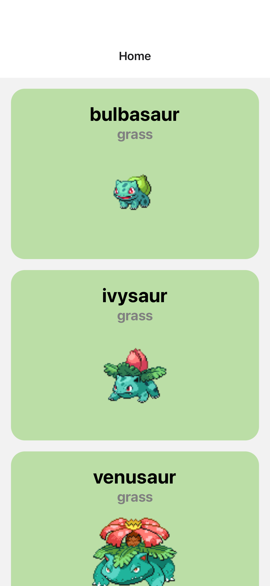
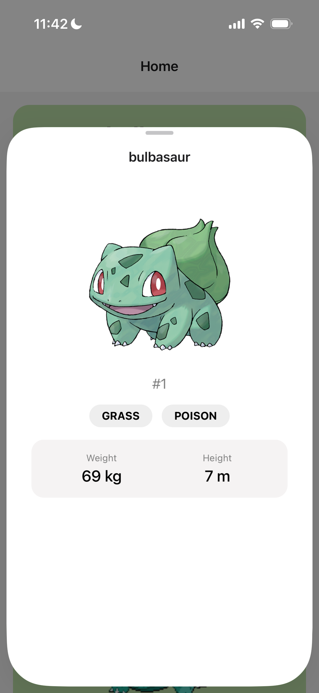

# Pokedex Mobile


A Pokedex application built to explore **React Native**, **Expo Router**, and **Gluestack UI**. This app fetches real-time data from the [PokeAPI](https://pokeapi.co/) and features a dynamic UI that adapts to Pokemon types.

## Screenshots

<div style="display: flex; flex-direction: row; gap: 10px;">
  
  
</div>

## Get Started

1. **Install dependencies**

   ```bash
   npm install
   ```
